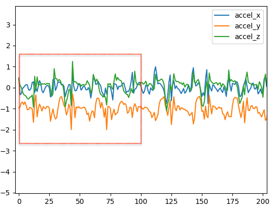
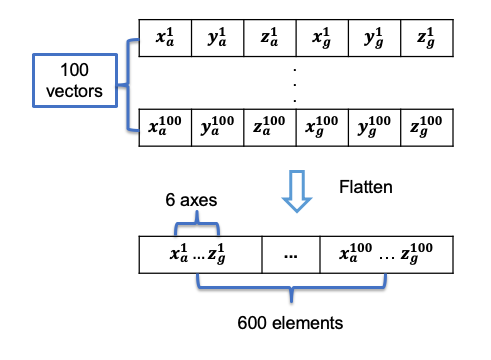
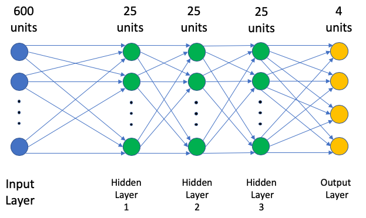
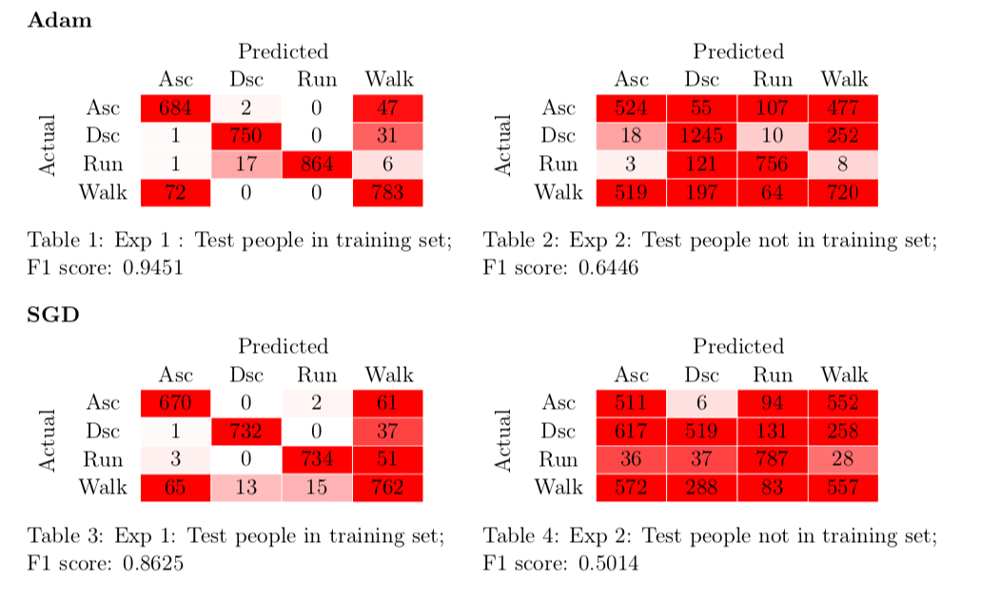

# CNN-Gait-Classification

## AIM
This project aims to classify different types of gait in real world through machine learning approach.

## MAIN TOOLS
Scikit-learn

## OverView

## Data collecion
Data were collected from android phones which was remotely connected to accelerometer sensors.

## Data preprocessing
Use window slides

Flatten the data

## CNN
Gradient descent optimization methods: ADAM and SGD

Neural netowork

## Results
Because of the limitation of data, we finally decided train our models using data collected from position Wrist. In whole dataset, only these data provide us just enough training set and test set.

(Since those data are private, I can only upload two example data sets).

In order to train a robust model, we set two experiments. In Experiment 1, our dataset has 15927 training examples and 3256 testing examples. In test set, people that we collect our test data from also provide training data in training set. We use such dataset trained two models based on Adam and SGD. The results shown as in Table 1 and 3. In Experiment 2, our dataset has 20816 training examples and 5076 testing examples. In test set, people that we collect our test data from not exist in training set. We use such dataset trained two models based on Adam and SGD. The results shown as in Table 2 and 4.

