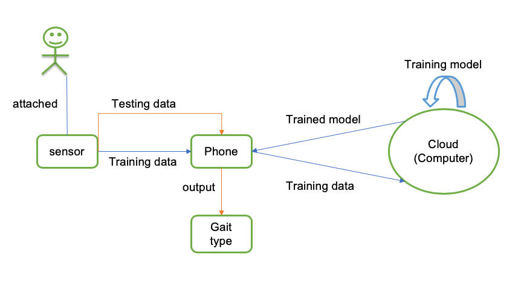

# CNN-Gait-Classification

## AIM
This project aims to classify different types of gait in real world through machine learning approach.

## MAIN TOOLS
Scikit-learn

## OverView

## Data collecion
Data were collected from android phones which was remotely connected to accelerometer sensors.

## Data preprocessing
Use window slides

Flatten the data

## CNN
Gradient descent optimization methods: ADAM and SGD

